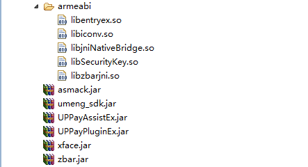
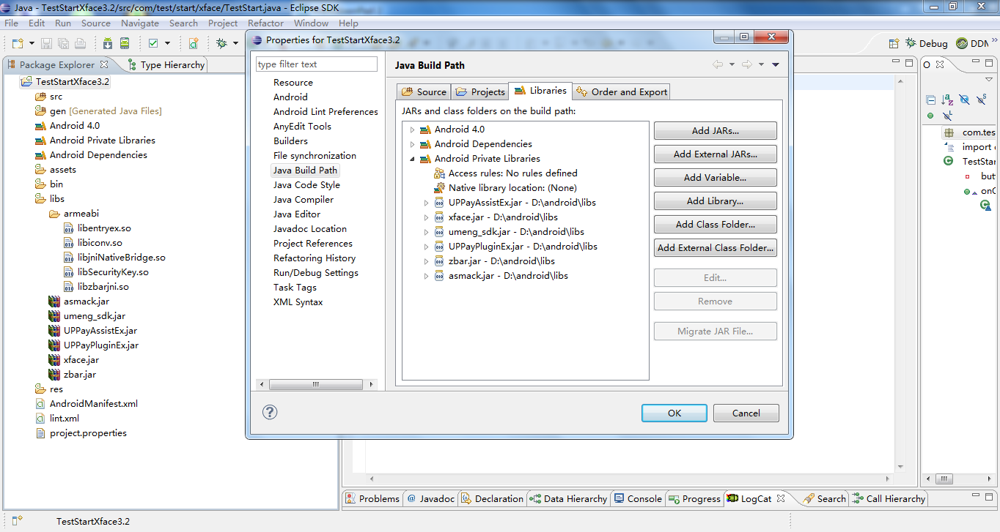
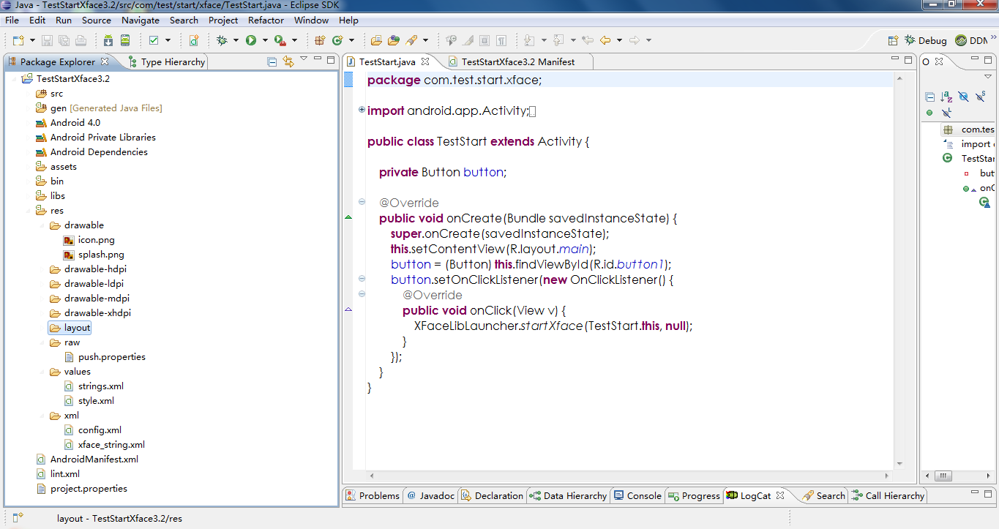
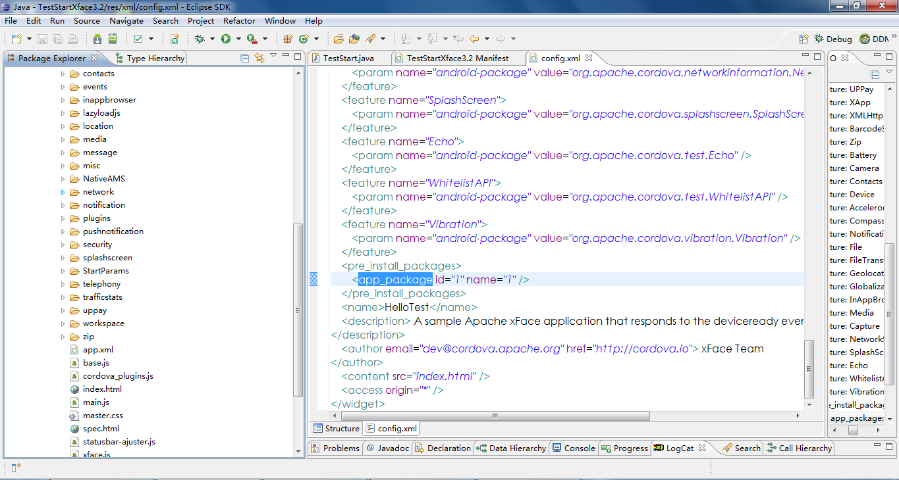
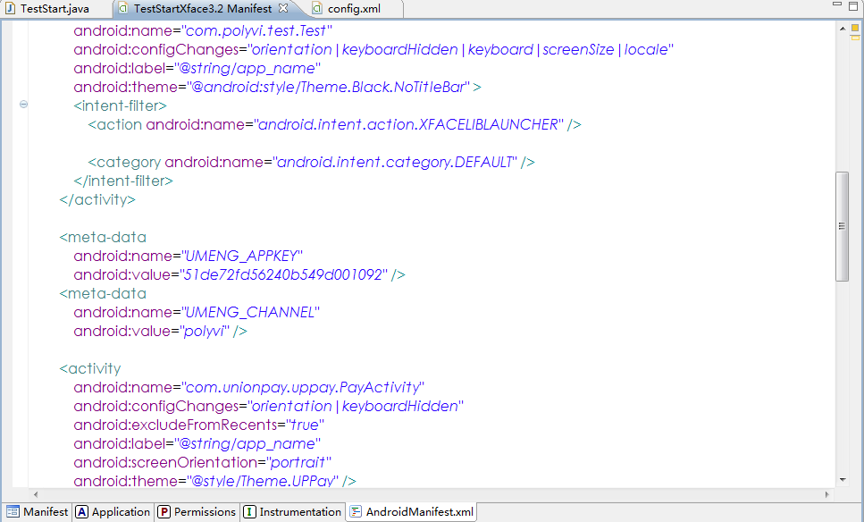
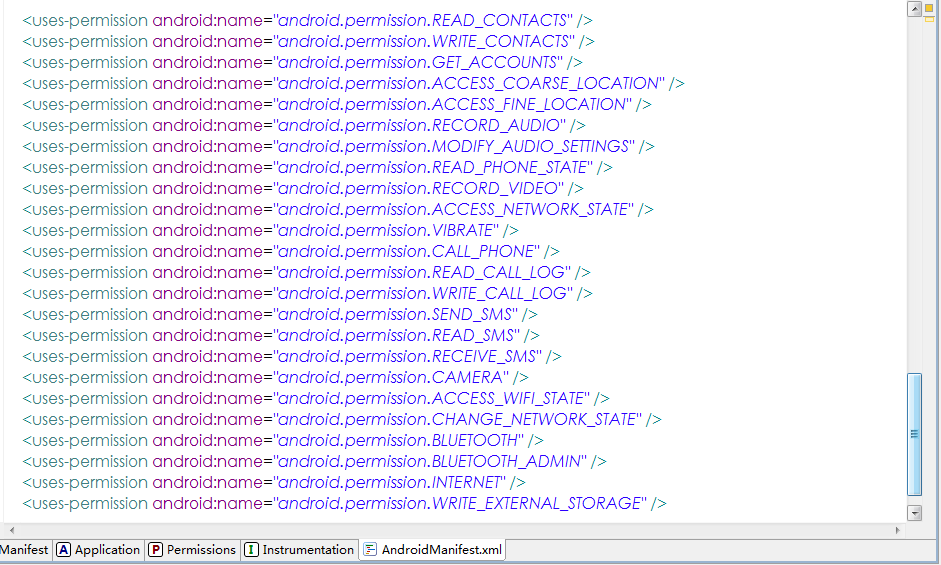

## Android平台

xFace提供了xface.jar库,第三方库以及所必须的资源文件,下图展示了demo工程添加xfaceLib后的整个目录结构：
 【图 xFaceLib】

本文档以"demo"工程为例说明第三方如何使用xFace Static Library,并且使用Eclipse作为开发平台.

_____

###一.调整demo工程

####1.添加xFaceLib
xFaceLib包含一个xface.jar文件和一些.so的动态链接库文件，下图【图 xfaceLib包含的库】展示了xfaceLib包含的所有库，其中xface.jar是xface引擎的库，其他库都是插件所需要的库，armeabi目录下的.so库都是插件所需要的库。添加库到工程，首先在demo工程下面新建一个libs目录,然后在libs目录下面新建一个arembi目录，然后将xFace提供的所有so文件拷贝到arembi目录下面，将xface.jar文件和其余的jar文件拷贝到libs目录下面,然后通过Java Build Path,将xface.jar添加到工程中,下图展示了demo工程添加了xfaceLib后的目录结构和状态.

【图 xfaceLib包含的库】

 【图 add xFaceLib】

**注意**
 如果你的android SDK版本是最新更新的,直接将xface.jar放入libs目录下就会自动添加xface.jar,如果是以前比较老的SDK版本需要通过右键工程->Build Path->Configure Bild Path...->Libraries->Add JARs...选择libs下的xface.jar添加到工程.

####2.添加资源到工程
将xface提供的资源文件添加到工程res目录下面，具体请参数demo工程。

**注意**
 添加xface启动splash图片名字必须为splash.png.

添加资源后的demo工程如下图所示：

【图 add Resource】

####3.添加应用到工程
 参照demo工程，将asset目录拷贝到工程的asset目录即可。添加应用之后如下图所示:
【图 add Test】

###二.xFace启动

修改demo的源代码,以启动xFace

####1.修改demo工程的AndroidMainfest文件的代码
由于xface程序中间包含Activity,Service等一些android的组件,还有运行程序所需要的权限，首先要在demo工程的manifest文件中进行申明,下图展示了demo工程mainfest文件添加的内容.

【图 demo AndroidMainfest】

`构建的lib包里面有一个manifest文件，所需要添加的权限以及相关组件配置请参照那个文件（如果权限没有配置完毕 则可能导致某些功能崩溃）.`

####2.添加xFace的启动代码
第三方程序启动xface可以分为两种，一种是普通模式的启动和优化模式启动，优化模式缓存了xFace的activity，这样首次启动xFace之后，再次启动，速度更快，但是第三方集成相对复杂。
#####(1)启动接口
    `XFaceLibLauncher.startXface(Activity srcActivity, Class targetClassName, String params,boolean isOptimization);`
上述代码中,srcActivity为启动xFace的activity对象， targetClassName为需要启动xFaceLib的ativity名称(如果第三方没有重载XFaceLibActivity, 默认为XFaceLibActivity·class)，params表示需要向xface传递的参数（该参数会被应用接收，请参照xFace SDK文档）,如果不传参数则传null。

#####(2)普通模式启动
在第三方程序中，启动xface添加如下代码:
    `String params = "params";`
    `XFaceLibLauncher.startXface(Activity srcActivity, XFaceLibActivity.class,params,false);`

#####(3)优化启动
在第三方程序中,启动xface添加如下代码:
    `String params = "params";`
    `XFaceLibLauncher.startXface(srcActivity, targetClassName, params,true);`
如果打开优化还需要在退出第三方程序的时候关闭xface:
    `XFaceLibLauncher.endXface();`
.

**注意**
 如果需要在第三方程序中监听xface退出的回调可以添加以下代码:
    `@Override
    protected void onActivityResult(int requestCode, int resultCode, Intent data) {
        if (resultCode == XFaceLibActivity.RESULT_OK) {
            // TODO:监听xface退出后需要执行的操作
        }
    }`
