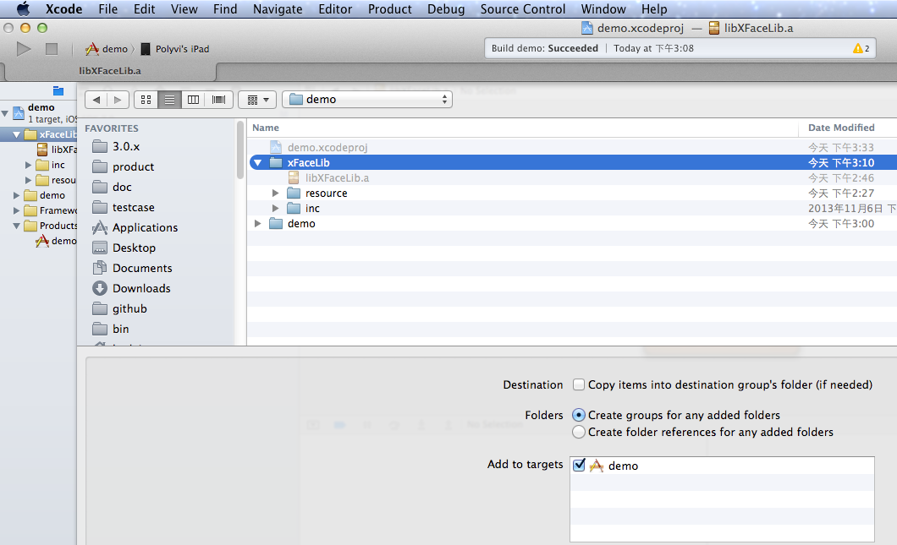

## libxFace iOS

xFace提供了xFaceLib.a以及相应的资源文件, 如图所示：

* 头文件 xface & Cordova，在lib/inc文件夹下
* 若干库文件，核心库文件为libxFaceLibAll.a，根据所依赖插件库，还可能包括libzbar.a, libMobClickLibraray.a, libuppay.a等
* 资源文件，在lib/Resource文件夹下
* config.xml，xface引擎依赖的配置文件


【图 xFaceLib Project】


本文档以“demo“工程为例说明第三方如何使用xFace Static Library.

_____

### 一. 参考demo工程

#### 1. 添加xFaceLib 和资源
xFace resource包括xFace启动时使用的launchImages、配置文件（config.xml）、xface3目录（用于放置xFace web app的源码）、assets（用于放置https的证书）目录以及其他资源文件，参见下图：

【图 add xFaceLib and resource】



  **注意** 
  
  由于xface3和assets目录是以目录的形式添加到工程的，所以需要删除其引用，然后重新以目录形式添加到工程。

【图 删除www和assets的引用】


【图 添加www和assets目录】


**注意**

添加xFace resource ，请确认新增资源出现在 TARGETS->demo->Build Phases->Copy Bundle Resources中，参见下图：

【图 Copy Bundle Resources】


#### 2. 添加Framesworks
根据readme.txt中记录的xface所依赖frameworks，在工程中逐个添加

添加Framesworks后的demo工程如下图所示：

【图 demo Frameworks】


#### 3. 修改工程配置
添加“-ObjC”到工程配置 TARGETS->demo->Build Settings->Other Linker Flags，参见下图：

【图 Other Linker Flags】


### 调用xFace

请参考ViewConroller.m 中的代码

### Preferences

请在config.xml中添加以下配置项

-  __LibRunningMode__ (string, 默认值为“normal”). 运行模式.

    ```
	normal    : xFace实例会被创建多次，即每次启动时创建xFace实例，退出时销毁xFace实例
	optimized : xFace实例只在加载XRootViewController时创建一次，通过postNotification启动xFace默认应用.使用此方式，xFace启动速度更快.
	
	注意：只有添加xface-extra-lib插件时才需配置LibRunningMode，非库模式下无需配置此项，即xFace按照normal的方式启动
	```

        <preference name="LibRunningMode" value="normal" />
            
- __CustomLaunchImageFile__ (string, 值为空时使用第三方LaunchImage). 启动xFace Lib时使用的Launch Image名称.

        <preference name="CustomLaunchImageFile" value="" />

